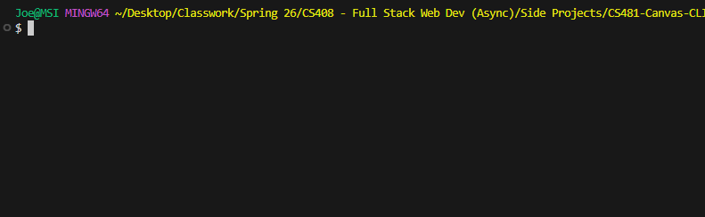

# Assignment 8.02

## Description
The "todo" tool prints a formatted list of assignments ordered by due date looking forward a certain number of days. It can include overdue items at the user's discretion.

## Demo


## Setup Instructions
1. Clone the repository:
    ```
    $ gh repo clone JoeS90/CS481-Canvas-CLI
    ```

2. Install Node.js v20.6.0 or higher. [NodeJS.org](https://nodejs.org "NodeJS.org")

3. Create a .env file using .env.example. Add your Canvas API key. Make sure you copy it into .env, which is in .gitignore, and not .env.example, which is not. Do not commit that key to a repository.

4. To run from the command line, navigate to the project directory and use one of the following:
    ```
    $ node Canvas.js todo <numDays> <ignorePastDue>
    $ TBD
    ```
    For "todo", numDays is an integer and defaults to 7, and ignorePastDue is a boolean and defaults to "true".

## Examples
Todo example:
```
$ node Canvas.js todo 1 false
Your 1-day To-Do List
3/11/2026:
        8.02 - Mini-Lab Canavs Fun (Sp26 - CS 408 - Full Stack Web Development) !!OVERDUE!!
3/13/2026:
        09.02 Final Project Checkpoint 1 (Sp26 - CS 408 - Full Stack Web Development)
```
(I'm aware of the irony...)

## API Endpoints
API Endpoints Used. A brief table or list describing which Canvas API endpoints your tool calls and what data it retrieves from each.
The project uses the following endpoints:

"/v1/users/self/todo?per_page=100" - retrieves up to 100 items from the user's todo list in canvas.

"/v1/courses/:id" - looks up the course name/nickname from a given course id code.

## Reflection
Two to three paragraphs reflecting on what you learned, what was challenging, and what you would improve if you had more time.

Once I got the format for the HTTP request figured out, that part was relatively simple. The biggest challenge was figuring out which endpoints would give me the exact data I needed and what format it would be returned in so I could parse it correctly.

If I had more time, I would dive deeper into formatting the command line returns, but as it stands, this project is already past due and I need to move on to other assignments. When I have time, I intend to come back and finish this one, but I am spending way too much time working on the Canvas-specific aspects rather than the broader full-stack concepts so at this point I have to shift my focus.

## AI Use
This is my first time relying on AI for more than just summarizing Google searches. I didn't let it write the code for me but I did use it to check syntax and offer suggestions for endpoints (which actually led me down a rabbit hole for a while). Any time it did recommend code changes, I deliberately looked for alternatives to achieve the intended improvement without copying the code.